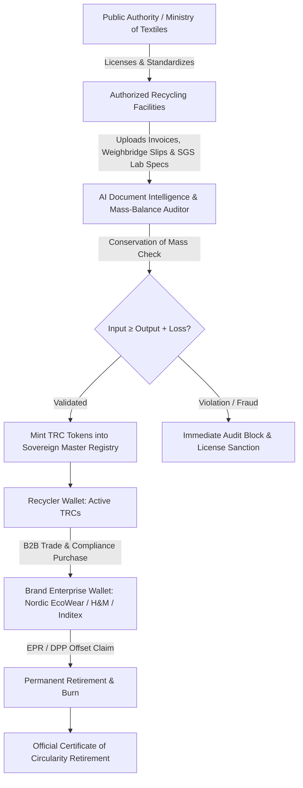

# Institutional Business Strategy & Policy Framework: Textile Recycling Credits (TRCs)

**Operating Body:** Public Authority / National Ministry of Textiles / Central Circularity & EPR Registry  
**Core Subject:** Economic Mechanism, Brand Usability, and Sovereign Governance of Textile Recycling Credits (TRCs)

---

## 1. Executive Summary & Problem Definition

### The Crisis of Physical Scrap Tracking
The global textile industry generates **over 92 million tons of textile waste annually**, with less than 1% mechanically or chemically recycled into new clothing. Historically, regulators and brands attempted to enforce circularity via **1:1 physical batch tracking** (tracing a specific post-consumer discarded shirt into a specific new thread). This model systematically fails because:
* **Complex Poly-Blends:** Blended materials (e.g., 60% cotton / 35% polyester / 5% elastane) require multi-stage chemical dissolution or garnetting where physical fiber identity is dissolved.
* **Extreme Multi-Tier Fragmentation:** Inbound scrap passes through 5 to 7 unregulated intermediaries (local rag pickers, sorters, balers, de-fibering mills, spinners, knitters, garment factories), causing catastrophic chain-of-custody data loss.
* **Informal Sector Disconnect:** Up to 80% of waste sorting in the Global South occurs in the informal economy without ERP systems.

### The Solution: A Public Authority Digital Credit Registry (Book-and-Claim)
By decoupling the environmental attribute of recycling from the physical commodity—mirroring the multi-billion dollar **Renewable Energy Certificates (RECs)** and **Low Carbon Fuel Standard (LCFS)** frameworks—the Public Authority issues verified **Textile Recycling Credits (TRCs)**:
$$\mathbf{1\text{ TRC}} \equiv \mathbf{1\text{ Kilogram (kg) of independently verified recycled textile fiber diverted from landfill/incineration}}$$

This operates with **Zero CapEx for the Government**, leveraging private brand capital to fund local sorting and mechanical recycling infrastructure.

---

## 2. Institutional Governance & Sovereign Registry Architecture



### Key Pillars of Public Governance:
1. **Accredited Facility Licensing:** Public Authority audits and registers approved mechanical recyclers, garnetting plants, and chemical recycling facilities.
2. **AI Document Intelligence & Mass-Balance Verification:** AI automatically ingests weighbridge gross/tare tickets, lab composition tests (AATCC 20A), and power consumption metrics to enforce conservation of mass:
   $$\text{Mass Balance Constraint: } M_{\text{Inbound Waste}} \ge M_{\text{Recycled Fiber Output}} + M_{\text{Process Loss}}$$
3. **Anti-Double-Counting Protocol:** Each TRC possesses a cryptographically signed serial number (`#00001 - #08200`), vintage date, and facility hash. Once a brand claims the credit, it is **permanently burned** on the immutable public ledger.

---

## 3. Brand Usability & Value Proposition for Fashion Brands

Why global fashion brands (Inditex, H&M, Nike, Patagonia, Kering) will purchase and retire TRCs:

### A. Mandatory Extended Producer Responsibility (EPR) & Virgin Fiber Tax Offsets
* **Regulatory Exemption:** Under the EU Waste Framework Directive (WFD) and national EPR textile laws, brands face escalating eco-modulated fees for every kilogram of virgin fiber placed on the market.
* **Direct Compliance:** Retiring TRCs serves as a legally recognized mechanism to offset virgin textile penalties, reducing net tax liabilities.

### B. Corporate Sustainability Due Diligence (CSDDD) & CSRD Scope 3 Compliance
* **Audited Scope 3 Data:** Under the Corporate Sustainability Reporting Directive (CSRD), brands must provide auditable proof of circular material investments. TRCs deliver pre-audited, regulator-stamped data packets for statutory ESG filings.

### C. Legal Substantiation Under the EU Green Claims Directive & FTC Green Guides
* **Eliminating Greenwashing Penalties:** Vague marketing claims like *"eco-friendly recycled cotton"* face severe fines (up to 4% of annual EU turnover). Retiring sovereign-registered TRCs provides undeniable mathematical proof of real-world waste diversion.

### D. Digital Product Passport (DPP) Consumer Transparency
* **Hangtag QR Integration:** Brands embed the TRC Retirement Certificate directly into the garment's QR Digital Product Passport. A shopper in Paris or New York scans the hangtag and views cryptographic proof that the brand funded the recycling of an equivalent weight of textile waste.

---

## 4. Economic Mechanism & Market Design

```
+---------------------------------------------------------------------------------------------------+
| TRC Price Ceiling: Set by Regional EPR Virgin Penalty / Landfill Tax ($0.60 - $0.90 / kg)          |
|                                                                                                   |
| Market Float Price: Determined by Recycler Premium Delta ($0.30 - $0.50 / TRC)                    |
|                                                                                                   |
| TRC Price Floor: Cost Delta between Virgin Fiber and Recycled Fiber Production ($0.15 - $0.25 / kg)|
+---------------------------------------------------------------------------------------------------+
```

### Market Dynamics:
1. **Primary Issuance:** TRCs are issued exclusively to the industrial recycler upon verified production. Revenue from selling TRCs closes the cost gap between recycled and virgin polyester/cotton.
2. **Economic Pull Effect on Waste Pickers:** High-margin TRC sales incentivize recyclers to pay higher gate fees for raw scrap ($+20\% - 35\%$), directly enriching municipal collectors and informal waste workers.
3. **Forward Offtake Contracts:** Brands execute multi-year forward purchasing agreements for TRCs, giving recycling facilities the bankable revenue needed to secure low-interest loans for facility expansion.

---

## 5. Implementation Roadmap for Public Authorities

| Phase | Timeline | Key Milestone |
|---|---|---|
| **Phase 1: Standardization & Pilot** | Months 1–6 | Publish TRC technical taxonomy (cotton/poly scrap eligibility), onboard top 10 recycling hubs, and integrate AI Mass-Balance Engine. |
| **Phase 2: Voluntary Registry Launch** | Months 7–18 | Launch sovereign public registry. Allow brands to retire TRCs for voluntary ESG disclosures, DPP hangtags, and FTC compliance. |
| **Phase 3: Mandatory EPR Harmonization** | Months 19–36 | Legislate TRC retirement as a statutory credit against national EPR textile levies. Enable cross-border registry interoperability. |
